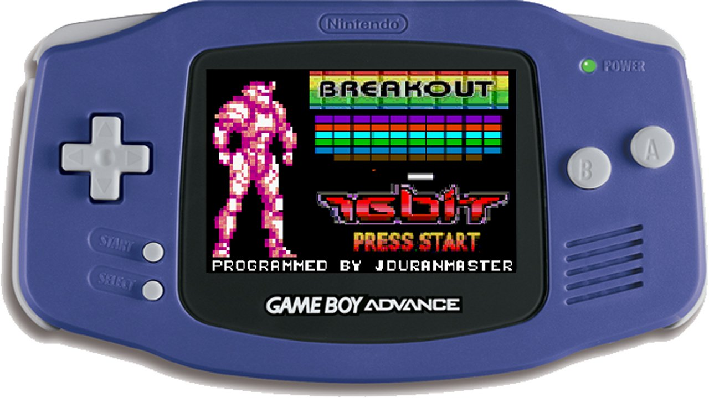

# GBA-BreakOut-Engine

A repository to storage the source code of the homebrew game "GBA-BreakOut" programmed for the Game Boy Advance. The BreakOut Game 
Engine has been developed in C programming language and DEVKITADV develpment kit.

BreakOut for GBA.
Author: Ryoga a.k.a. JDURANMASTER
New step, on GBA programming. This module is a sample BreakOut-clone.

- Testing GBA mode 4, double buffering, keyboard controlling.
- No sound implemented yet

Change the following compilation script if you need to do it in order to compile the source
code in your local system.

SET PATH=D:\devkitadv\bin

gcc -c -O3 -mthumb -mthumb-interwork BreakOut.cpp

gcc -mthumb -mthumb-interwork -o BreakOut.elf BreakOut.o

objcopy -O binary BreakOut.elf BreakOut.gba

del *.o
del *.elf

The project also includes the pcx2gba tool.
